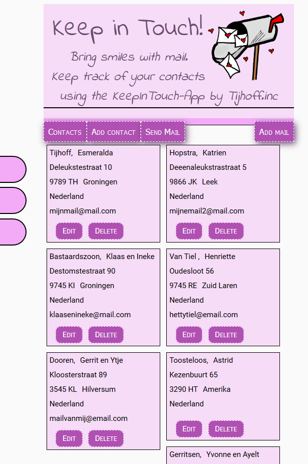
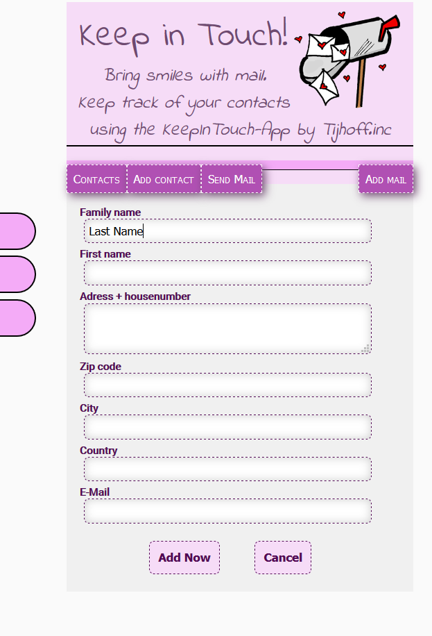
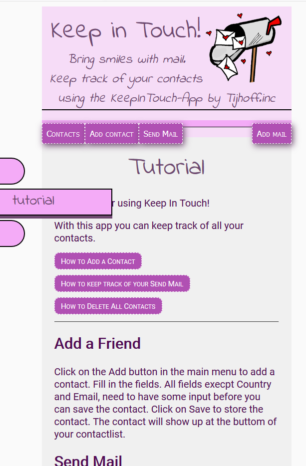

# addressboek in JavaScript
CodeGorilla assignment

This addresbook is completely written in JavaScript, HTML5 and CSS3. 

It contains:

Main menu
Side menu
Hidden pages About, Settings, Tutorial, Send Mail
Hidden contactsform
Hidden page for the send Mail Form
pushing contacts in localstorage
deleting contacts per item 
deleting all contacts
Show adressbook

